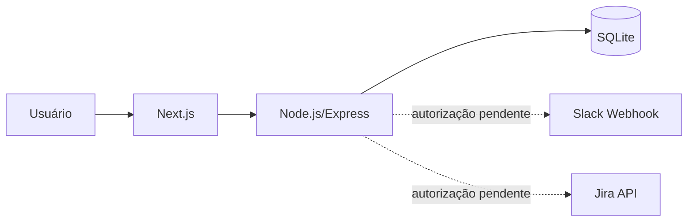
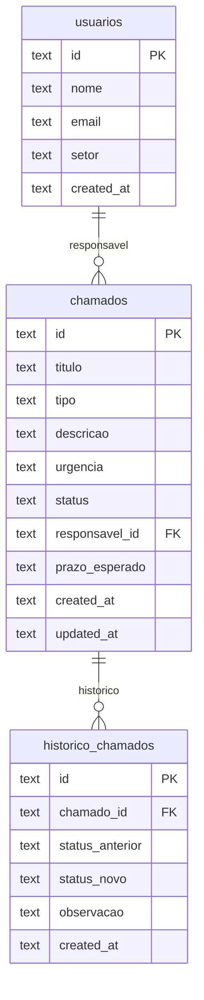

# Sistema Interno de Chamados - VT Innovation

MVP acadêmico desenvolvido para centralizar demandas técnicas internas da VT Innovation. O sistema permite abrir chamados, acompanhar status, filtrar demandas, consultar detalhes e registrar histórico de atualização.

Este repositório acompanha o Projeto de Extensão V do curso de Análise e Desenvolvimento de Sistemas da Descomplica. O código é a fonte de verdade da documentação.

## Status

- Frontend Next.js implementado
- Backend Node.js/Express implementado
- Banco SQLite local implementado
- CRUD principal de chamados implementado
- Histórico de status implementado
- Estrutura de integração com Slack preparada
- Estrutura de integração com Jira preparada
- Integrações externas dependem de autorização/configuração da empresa

## Funcionalidades

- Criar chamados com título, tipo, descrição, urgência, responsável e prazo esperado
- Listar chamados no dashboard
- Filtrar chamados por status, tipo e urgência
- Visualizar detalhe individual do chamado
- Atualizar status com observação
- Registrar histórico de mudanças de status
- Listar usuários responsáveis cadastrados no seed

## Arquitetura



## Tecnologias

- Frontend: Next.js 14, React, TypeScript, Tailwind CSS
- Backend: Node.js, Express
- Banco de dados: SQLite com better-sqlite3
- Integrações preparadas: Slack Webhook e Jira API

## Pré-requisitos

- Node.js 18+
- npm

## Execução Local

### Backend

```bash
cd backend
npm install
cp .env.example .env
npm run seed
npm run dev
```

Servidor: `http://localhost:3001`

### Frontend

```bash
cd frontend
npm install
cp .env.local.example .env.local
npm run dev
```

Aplicação: `http://localhost:3000`

## Variáveis de Ambiente

Backend (`backend/.env`):

```env
SLACK_WEBHOOK_URL=
PORT=3001
FRONTEND_URL=http://localhost:3000
```

Frontend (`frontend/.env.local`):

```env
NEXT_PUBLIC_API_URL=http://localhost:3001
```

`SLACK_WEBHOOK_URL` deve permanecer vazio enquanto a empresa não autorizar o uso do webhook.

## Endpoints

| Método | Rota | Descrição |
| --- | --- | --- |
| `GET` | `/` | Verificação do backend |
| `GET` | `/api/usuarios` | Lista usuários responsáveis |
| `POST` | `/api/chamados` | Cria chamado |
| `GET` | `/api/chamados` | Lista chamados com filtros opcionais |
| `GET` | `/api/chamados/:id` | Retorna detalhe e histórico |
| `PATCH` | `/api/chamados/:id` | Atualiza status e registra histórico |

### Exemplo de criação

```json
{
  "titulo": "Corrigir bug na autenticação",
  "tipo": "Bug",
  "descricao": "Usuários não conseguem acessar a área interna",
  "urgencia": "Alta",
  "responsavel_id": "id-do-usuario",
  "prazo_esperado": "2026-06-05"
}
```

## Banco de Dados

O banco é criado automaticamente em `backend/database.sqlite`.

Tabelas:

- `usuarios`: responsáveis disponíveis para atribuição
- `chamados`: chamados registrados
- `historico_chamados`: mudanças de status com observação

MER simplificado:



## Estrutura

```text
backend/
  src/
    app.js
    controllers/ticketsController.js
    database/db.js
    database/seed.js
    routes/ticketsRoutes.js
    services/slackService.js
    services/jiraService.js
frontend/
  src/
    app/
      page.tsx
      novo/page.tsx
      chamados/[id]/page.tsx
    components/
      Header.tsx
      StatusBadge.tsx
      PriorityBadge.tsx
      TicketCard.tsx
      TicketForm.tsx
    lib/api.ts
docs/
  pex-v-vt-innovation-revisado.md
```

## Evidências Recomendadas

Adicionar ao repositório, em `docs/evidencias/`:

- Print do formulário de abertura
- Print do dashboard
- Print da tela de detalhe com histórico
- Print da execução local do backend
- Print do build do frontend
- Print do schema ou trecho do banco SQLite
- Print da notificação Slack apenas após autorização da empresa

## Limitações Conhecidas

- Não há autenticação de usuários
- Não há deploy público configurado
- Não há testes automatizados
- Slack e Jira estão preparados estruturalmente, mas dependem de autorização e credenciais da empresa
- O escopo foi mantido simples para atender ao objetivo do Projeto de Extensão V
